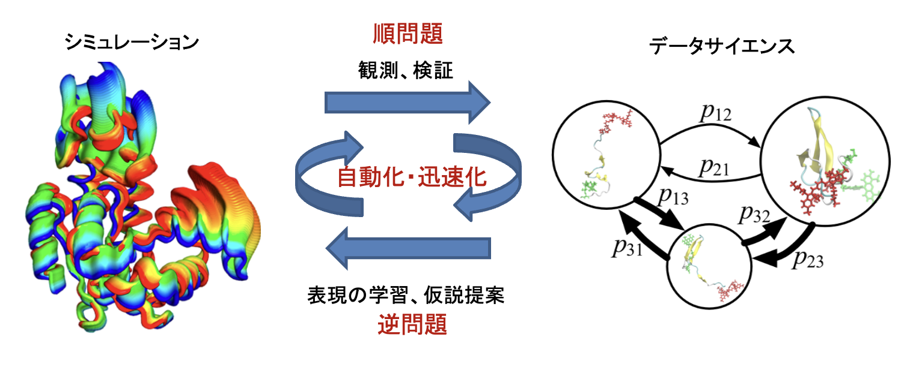

### Research Overview / 研究の概要

Many biological phenomena are carried out by string-like molecules called proteins. While proteins exhibit mysterious behaviors designed through billions of years of evolution, they are also involved in many diseases, making them important research subjects. Proteins are extremely complex, consisting of thousands to hundreds of thousands of atoms. How can we study such complex entities? We approach this problem through information engineering. We develop and apply methods (simulation) to construct proteins in virtual computer space and observe them in detail by mimicking natural laws. We then have computers understand the big data obtained from simulations (data science) to generate new hypotheses and conduct further simulations. Our goal is to understand and control protein behavior by developing frameworks and software that rapidly and automatically cycle through this process, specifically contributing to rational design for improving protein function and drug design.

生命現象の多くはタンパク質というヒモ状の分子が担っています。タンパク質は数十億年におよぶ進化の過程でデザインされた神秘的なふるまいを持つ一方で、多くの病気にも関与している重要な研究対象です。タンパク質はとても複雑であり、数千から数十万個の原子からできています。このように複雑なものをどのようにして調べることができるでしょうか？私たちはこの問題に対し情報工学からアプローチしています。コンピュータの仮想空間の中でタンパク質を構築し、自然法則を真似て詳しく観察する手法(シミュレーション)を開発し応用する。そしてそこから得られたビッグデータもコンピュータに理解させ(データサイエンス)、次の仮説を作り出しシミュレーションを行う。このサイクルを迅速・自動的にまわすフレームワークとソフトウェアを開発することでタンパク質のふるまいを理解し制御する、具体的にはタンパク質機能を改善する合理的デザインや薬剤設計へ貢献することを目標としています。

#### Research Themes / 研究テーマ

##### 1. Simulation Methods / シミュレーション手法

If we can explore protein structures in a short time through simulation, various applications such as drug discovery and new molecule design can be expected. We are working on developing and applying methods to achieve this.

シミュレーションでタンパク質の構造を短時間で探索できるようになれば、創薬や新規分子の設計など様々な応用が期待できます。それを実現するための手法開発と応用に取り組んでいます。

##### 2. Application of Machine Learning / 機械学習の応用

By performing statistical analysis and machine learning on structural databases and simulation data, we can simplify complex phenomena that are incomprehensible to humans. We are working on research to create excellent predictive models and provide feedback to simulations based on simplified information.

構造データベースやシミュレーションデータの統計解析や機械学習を行うことで、人間には理解不能な複雑な現象を簡単化できます。簡単化した情報を元に、優れた予測モデルを作ったり、シミュレーションへフィードバックする研究に取り組んでいます。

##### 3. Integration of Experimental Data / 実験データの統合

Since simulation models are not always correct, modeling that combines experimental data information is effective. Therefore, we are working on developing and applying methods to integrate experimental data using machine learning and Bayesian inference.

シミュレーションのモデルは常に正しいとは限らないので、実験データの情報を組み合わせるモデリングが有効となります。そこで、機械学習やベイズ推定を用いて、実験データを統合する手法の開発と応用に取り組んでいます。

---

#### Detailed Explanation of Research Themes / 研究テーマの詳しい説明

##### 1. Simulation Methods / シミュレーション手法

As molecular simulation is also called a computational microscope, it is one of the powerful methods for observing behavior in the microscopic world. In this sense, developing theories and algorithms for molecular simulation is an engineering challenge, just like developing microscopes.

分子シミュレーションは計算顕微鏡(computational microscope)とも呼ばれているように、ミクロな世界のふるまいを観察する有力な手法のひとつです。その意味で、分子シミュレーションの理論やアルゴリズムを開発することは、顕微鏡の開発と同じく工学的な課題のひとつと言えます。

One of the simulation methods we work on is [molecular dynamics simulation](https://en.wikipedia.org/wiki/Molecular_dynamics), which numerically solves Newton's equation of motion (F=ma) that you learn in middle school. This is very simple: calculate interatomic distances, compute the forces acting on each atom, move the atomic coordinates slightly according to F=ma, and repeat this many times to observe the motion of atoms and molecules. With just this, we can investigate in detail how proteins behave. Specifically, we can examine many properties such as: What structures can it take? Does the structure change easily? How does it change structure? How easily does a drug bind? What is the relationship between drug binding energy and structure? Does it easily bind to other proteins?

我々が取り組んでいるシミュレーション法のひとつである[分子動力学法](https://ja.wikipedia.org/wiki/分子動力学法)(molecular dynamics simulation)は、中学校で習うニュートンの運動方程式(F=ma)を数値的に解く手法です。これは非常にシンプルで、原子間距離を計算してそこから各原子に働く力を計算し、F=maに従って原子の座標を少し動かす、それを何回も繰り返して原子・分子の運動を見る、ということをやっています。たったこれだけことですが、そこからタンパク質がどうふるまうのかを詳しく調べることができます。具体的には、どのような構造をとりえるのか？構造が変化しやすいか？どうやって構造変化するか?薬剤がどれくらい結合しやすいか？薬剤結合エネルギーと構造との関係は?他のタンパク質と結合しやすいか？といった多くの性質を調べることができます。

However, molecular dynamics has a drawback of being "slow". For example, the time scale for proteins to change structure and function is approximately milliseconds ($10^{-3}$ seconds), but one step of molecular dynamics simulation is femtoseconds ($10^{-15}$ seconds). To reach milliseconds, $10^{12}$ update calculations are needed, which is difficult even with supercomputers. Also, evaluating whether a drug binds easily takes about one day per drug. This makes it difficult to comprehensively evaluate tens of thousands of drug candidates.

しかしながら分子動力学法には「遅い」という欠点があります。たとえば、タンパク質が構造を変えて機能する時間スケールはおよそミリ秒($10^{-3}$秒)ですが、分子動力学シミュレーションの1ステップはフェムト秒($10^{-15}$秒)です。ミリ秒に到達するためには、$10^{12}$回のアップデート計算が必要ですが、スーパーコンピュータを用いたとしてもむずかしいのが現状です。また、薬剤が結合しやすいかを評価するのも、計算するのに1薬剤あたりおよそ1日かかってしまいます。これでは数万個の薬剤候補を網羅的に評価することはむずかしいです。

We are researching ways to overcome this "slow" drawback. One way to speed up calculations is to parallelize the simulation program. For example, grouping atoms that are close together and having different computers handle the force calculations (interatomic distance calculations) is an effective parallelization method (though it's not always effective since atoms need to move between groups). With proper parallelization, we can leverage parallel computing environments like supercomputers for high-speed calculations. This level of parallelization has a long history, and software that has been developed and implemented over many years includes [GENESIS](https://www.r-ccs.riken.jp/labs/cbrt/) from our collaborator RIKEN, [GROMACS](http://www.gromacs.org) from Europe, and [AMBER](http://ambermd.org) and [NAMD](http://www.ks.uiuc.edu/Research/namd/) from the US.

我々はこの「遅い」という欠点を克服しようと研究しています。計算を速くする方法のひとつは、シミュレーションのプログラムを並列化することです。例えば、各原子を近いもの同士でグループに分けて、それぞれ別のコンピュータに保有させて力の計算(原子間距離の計算)を行うことは有効な並列化のひとつです(原子が動くとグループ間の移動が必要なので一概に有効とは言えませんが)。うまく並列化するとスーパーコンピュータ等の並列計算環境を活かして高速に計算することができるようになります。このレベルの並列化には歴史があり、何年にも渡って開発・実装されてきているのが共同研究先の理化学研究所の[GENESIS](https://www.r-ccs.riken.jp/labs/cbrt/)、ヨーロッパの[GROMACS](http://www.gromacs.org)、米国の[AMBER](http://ambermd.org)や[NAMD](http://www.ks.uiuc.edu/Research/namd/)といった分子動力学法ソフトウェアです。 

From a different perspective, what we have been particularly working on recently is meta-level parallelization. Simply put, instead of running one simulation for a long time, we research whether we can calculate the target statistics (such as which protein structures are stable or how easily drugs bind) in a short time by coordinating many simulations. For example, there is an approach to run many independent simulations with different structures in parallel and integrate the data using machine learning under the Markov approximation. Another approach is to "parallelize" Newton's equation of motion (F=ma) in the time direction and efficiently explore solutions to the equation using many simulations (called the string method). We used this string method on the K computer to simulate the drug transport process of a large protein that causes drug resistance (see the video below; details [here](http://www.riken.jp/pr/press/2018/20180312_1/)). We believe that this meta-level parallelization can be made even more efficient by combining it with machine learning on simulation data. For example, we can consider approaches like Bayesian optimization, where machine learning is performed during simulation to estimate structural regions that have not been sufficiently sampled, and then the next simulations are intensively deployed around those areas, repeating this process. We are also working on developing machine learning-based surrogate models that can predict results much faster than running actual molecular dynamics simulations. We are also working on data analysis methods to realize this (continued next).

別の視点で、我々が最近特に取り組んでいることは、ひとつメタなレベルでの並列化です。単純に言うと、一つのシミュレーションを長時間はしらせる代わりに、多数のシミュレーションを連携して流すことで目的の計算(たとえばどのようなタンパク質構造が安定か、薬剤が結合しやすいかといった統計量)を短時間で計算できないか、ということを研究しています。例えば、構造の異なる独立なシミュレーションを並列にたくさんはしらせて、マルコフ性の近似のもとで、機械学習を使ってデータを統合するといったアプローチがあります。他には、ニュートンの運動方程式(F=ma)を時間方向に「並列化」して、多数のシミュレーションを使って方程式の解を効率よく探索するというアプローチがあります(ストリング法と呼ばれます)。我々は少し前にこのストリング法を駆使して、京コンピュータ上で薬剤耐性の原因となる巨大タンパク質の薬剤輸送過程をシミュレートしました(下の動画、詳しくは[こちら](http://www.riken.jp/pr/press/2018/20180312_1/))。このメタなレベルの並列化は、シミュレーションデータの機械学習と組み合わせることでまだまだ効率化することができると考えています。例えば、シミュレーションの途中で機械学習を行って、まだサンプリングが足りていない構造領域を推定し、次のシミュレーションではその付近に集中的にシミュレーションをばらまく、そしてそれを繰り返す、といったベイズ最適化などのアプローチが考えられます。また、分子動力学シミュレーションの代わりに結果を高速に予測できる機械学習ベースのサロゲートモデルの開発にも取り組んでいます。それを実現させるためのデータ解析法にも取り組んでいます(次へ続く)。



References

- J. Jung, K. Yagi, C. Tan, H. Oshima, T. Mori, I. Yu, Y. Matsunaga, C. Kobayashi, S. Ito, D. Ugarte La Torre, and Y. Sugita, "GENESIS 2.1: High-Performance Molecular Dynamics Software for Enhanced Sampling and Free-Energy Calculations for Atomistic, Coarse-Grained, and Quantum Mechanics/Molecular Mechanics Models" Journal of Physical Chemistry B 128, 6028-6048 (2024) [DOI:10.1021/acs.jpcb.4c02096](https://doi.org/10.1021/acs.jpcb.4c02096)
- Y. Matsunaga, T. Yamane, T. Terada, K. Moritsugu, H. Fujisaki, S. Murakami, M. Ikeguchi, and A. Kidera, "Energetics and conformational pathways of functional rotation in the multidrug transporter AcrB", eLife 7, e31715 (2018) [DOI:10.7554/eLife.31715](https://doi.org/10.7554/eLife.31715)
- R. Higashida and Y. Matsunaga, "Enhanced Conformational Sampling of Nanobody CDR H3 Loop by Generalized Replica-Exchange with Solute Tempering", Life 11, 1428 (2021) [DOI:10.3390/life11121428](https://doi.org/10.3390/life11121428)

<!---
- 松永康佑 "全原子分子動力学シミュレーションが解き明かす多剤排出トランスポーターAcrBの薬剤排出機構" 生物物理 59巻2号, 084-087 (2019) [DOI:10.2142/biophys.59.084](https://doi.org/10.2142/biophys.59.084)

- Y. Matsunaga, T. Yamane, T. Terada, K. Moritsugu, H. Fujisaki, S. Murakami, M. Ikeguchi, and A. Kidera, "[Energetics and conformational pathways of functional rotation in the multidrug transporter AcrB](https://elifesciences.org/articles/31715)", eLife 7, e31715 (19 pages) (2018) (日本語による解説 「[多剤排出トランスポーターの薬剤排出機構を解明 －スーパーコンピュータ「京」で巨大分子機械の動きを計算－](http://www.riken.jp/pr/press/2018/20180312_1/)」)

- C. Kobayashi, J. Jung, Y. Matsunaga, T. Mori, T. Ando, K. Tamura, M. Kamiya, and Y. Sugita,"[GENESIS 1.1: A hybrid-parallel molecular dynamics simulator with enhanced sampling algorithms on multiple computational platforms](https://onlinelibrary.wiley.com/doi/abs/10.1002/jcc.24874)" Journal of Computational Chemistry 38, 2193-2206 (2017)
-->

##### 2. Application of Machine Learning / 機械学習の応用

We mentioned above that molecular simulation has the drawback of being "slow", but even so, a speed improvement of $10^{5}$ times has been achieved over the past 30 years with advances in computers and algorithms. In the field of biophysics, there is a problem called "protein folding". Proteins are known to spontaneously fold from a random structure into a fixed structure, and the question is: why can they find the unique structure among countless possible structures in such a short time? One way to investigate this is to simulate the protein folding process, but until recently, folding proteins through simulation was just a dream.

上で分子シミュレーションは「遅い」ことが欠点であると言いましたが、それでも計算機やアルゴリズムの進歩とともに、この30年で$10^{5}$倍もの速度向上が実現されてきました。生物物理という研究分野では、「タンパク質のフォールディング」という問題があります。タンパク質はランダムな構造から自発的に決まった構造へ折れたたむ(フォールディング)することが知られていますが、なぜ短時間のうちに他の無数にとりうる構造の中から唯一の構造を探すことができるのだろう？という問題です。これを調べるには、タンパク質がフォールディングする過程をシミュレーションしてみるのがひとつの手段ですが、一昔前はシミュレーションでタンパク質をフォールディングさせることは夢物語でした。

However, in recent years, folding small proteins has become commonplace using supercomputers, dedicated machines, and GPUs. For example, the video below shows a folding simulation of a protein called villin headpiece. The experimental structure (the correct answer) is overlaid in red, and you can see that the simulation reproduces it well. On the other hand, watching this video shows that even for such a small protein, the folding process is extremely complex, making it impossible for humans to interpret the mechanism from this video. In other words, while we can now perform simulations, the results are too complex to interpret. In fact, in the field of molecular simulation research, a research style has been established where groups good at data analysis receive long-time simulation data from groups with fast computers and report the results of their data analysis. With the acceleration of simulations, the focus is gradually shifting from simulation to data science.

しかし、ここ数年ではスパコンや専用計算機・GPUを使えば、小さなタンパク質をフォールディングさせることは当たり前になってきています。例えば、下の動画は villin headpiece というタンパク質のフォールディングシミュレーションです。正解構造である赤の実験データを重ねて描いていますが、それをシミュレーションだけでよく再現できていることがわかります。一方でこの動画を見ると、こんな小さなタンパク質でもフォールディングする過程は非常に複雑で、もはや人間がこの動画からメカニズムを解釈することは不可能に思えます。つまりシミュレーションはできるようになったけれど、その結果が複雑すぎて解釈できないという事態が生じています。事実、最近の分子シミュレーション研究の分野では、データ解析が得意な研究グループが、早い計算機を持つ研究グループが行った長時間のシミュレーションデータを提供してもらい、データ解析だけ行ってその結果を報告する研究スタイルが確立しています。シミュレーションの高速化に伴って、段々とシミュレーションからデータサイエンスのほうへ比重がシフトしつつあります。



What kind of information should we extract through data analysis? Simulation data consists of many XYZ coordinates for all atoms arranged in time order (multivariate time series data). Roughly speaking, the goal is to reduce this to low dimensions that humans can understand or capture a few important amino acids. For the protein folding problem mentioned earlier, the goal is to find low-dimensional coordinates that well describe the progress from random structure to stable structure. For example, one approach is to extract data that folded successfully without failing halfway, and data that failed and returned to random structure, and perform regression or discriminant analysis. However, since there are countless combinations of coordinates, reducing to low dimensions is a challenging problem. We are currently working on analysis methods using sparse modeling. The video below is an example where a faculty member performed simple principal component analysis on coarse-grained protein simulation data long ago.

データ解析を行ってどのような情報を抽出できればよいでしょうか？シミュレーションデータは、全ての原子についてのたくさんのXYZ座標が時間順に並んでいるデータ(多変量時系列データ)です。大雑把にはこれを人間が理解したり少数の重要なアミノ酸を捉えることができるくらい低次元に縮約することが目標となります。先ほどのタンパク質フォールディングの問題だと、ランダムな構造から安定構造への進捗をよく記述できる低次元座標を探すことが目標となります。これは例えば、途中で失敗せずにうまくフォールドしたデータと、失敗してランダム構造へ戻ってしまったデータとを抜き出して、それらを使って回帰や判別分析などを行うアプローチが考えられます。しかし座標の組み合わせは無数にあるので低次元に縮約するのはチャレンジングな問題です。現在我々はスパースモデリングを使う解析法に取り組んでいます。下の動画は教員が昔にタンパク質の粗視化モデルのシミュレーションデータに対して素朴な主成分解析を行ってみた例です。

In molecular motors, transporters, and some enzymes, structures change significantly to perform "work" such as movement, transport, and feedback control. This is achieved by spatially distant amino acids moving in coordination, or local events coordinating with global movements, collectively called allosteric control. When analyzing simulation data of such proteins, it is considered effective to identify groups involved in allosteric control by analyzing amino acids that move in correlation, and then analyze why they can move in correlation from the perspective of energy and networks.

分子モーターやトランスポーター、一部の酵素では、構造が大きく変化して移動・輸送やフィードバック制御といった「仕事」をします。これは空間的に離れたアミノ酸が連携して動いたり、ローカルなイベントがグローバルな動きと連携することで実現されており、総称してアロステリック制御と呼ばれています。こうしたタンパク質のシミュレーションデータを解析する場合は、相関を持って動いているアミノ酸を解析してアロステリック制御に関わるグループを特定した上で、なぜ相関を持って動けるのかをエネルギーやネットワークの観点から解析するのが有効と考えられています。

Also, a basic but most important analysis is whether we can estimate the thermodynamic stability/instability of each structure obtained from simulation from limited data (called free energy estimation). This is not only essential for correspondence with stable structures observed in experiments, but also important for estimating what percentage each structure exists at, how high the energy barriers between structures are and whether transitions can occur, and for evaluating drug and protein binding affinity. By simultaneously evaluating estimation errors due to limited data, this also provides guidance on where to focus the next simulation. We are currently working on analysis methods using Gaussian processes.

また、ベーシックですが最重要な解析として、シミュレーションで得られた各構造の熱力学的安定性・不安定性を限られたデータ数から推定できるかという問題があります(自由エネルギー推定と呼ばれます)。これは実験で観測される安定構造との対応をとるために不可欠であるばかりでなく、構造がそれぞれ何％の割合で存在するのか？構造間のエネルギーバリアはどれくらい高くてその間の移動は起こり得るか？といった推定や、薬剤やタンパク質間の結合しやすさを評価する上で大切です。また、データ数が少ないことによる推定のエラーも同時に評価することで、次のシミュレーションはどこを重点的に行なったらよいかの指針にもなります。これに関して、現在我々はガウス過程を使う解析法に取り組んでいます。

Finally, there is the challenge of whether we can propose amino acid mutations that modify protein function, such as improving thermodynamic stability, through data analysis from simulation data. It is considered effective to estimate this by "integrating" with mutation experiment data registered in databases. For example, the [ProTherm](https://www.iitm.ac.in/bioinfo/ProTherm/) database contains data on how much more stable or unstable a protein becomes when certain amino acid residues are mutated. This will be integrated with stable structures and amino acid residue interaction data obtained from simulation data. We are also conducting research to integrate different types of data for modeling and make more accurate predictions (continued next).

最後に、シミュレーションデータからデータ解析によって、タンパク質の機能を改変する、例えば熱力学的安定性を向上させるアミノ酸変異を提案できるかという課題があります。これを行うにはデータベースに登録されている変異実験データと「統合」して推定するのが有効だと考えられます。例えば、[ProTherm](https://www.iitm.ac.in/bioinfo/ProTherm/)というデータベースには、あるタンパク質のどのアミノ酸残基を変異させたらどれくらい安定・不安定になったか、というデータが登録されています。これとシミュレーションデータから得られた安定構造やアミノ酸残基間の相互作用データを統合することになります。こうした異なる種類のデータを統合してモデリングを行い、より正確な推定を行うための研究も行っています(次へ続く)。



References

- T. Ishizone, Y. Matsunaga, S. Fuchigami, and K. Nakamura, "Representation of Protein Dynamics Disentangled by Time-Structure-Based Prior" Journal of Chemical Theory and Computation 20, 436-450 (2023) [DOI:10.1021/acs.jctc.3c01025](https://doi.org/10.1021/acs.jctc.3c01025)
- Y. Matsunaga, Y. Komuro, C. Kobayashi, J. Jung, T. Mori, and Y. Sugita, "Dimensionality of Collective Variables for Describing Conformational Changes of a Multi-Domain Protein" The Journal of Physical Chemistry Letters 7, 1446–1451 (2016) [DOI:10.1021/acs.jpclett.6b00317](https://doi.org/10.1021/acs.jpclett.6b00317)
- Y. Matsunaga, M. Kamiya, H. Oshima, J. Jung, S. Ito, and Y. Sugita, "Use of multistate Bennett acceptance ratio method for free-energy calculations from enhanced sampling and free-energy perturbation", Biophysical Reviews 14, 1503-1512 (2022) [DOI:10.1007/s12551-022-01030-9](https://doi.org/10.1007/s12551-022-01030-9)

##### 3. Integration of Experimental Data / 実験データの統合

The behavior of proteins calculated by simulation does not always match what actually happens in nature. This is because the models describing interatomic interactions (called force fields) are simplified approximations. On the other hand, single-molecule measurement techniques such as high-speed Atomic Force Microscopy (high-speed AFM) and single-molecule Fluorescence Resonance Energy Transfer (single-molecule FRET) have advanced in recent years, making it possible to observe the motion of individual protein molecules like a movie or to measure intramolecular distances over time. By combining simulation and experimental data, both sides benefit: simulations can achieve more accurate modeling through correction with experimental data, while experiments can interpret and understand experimental data using the atomic-level detailed information from simulations.

シミュレーションで計算されるタンパク質のふるまいは、必ずしも自然界で実際に起きていることと一致するわけではありません。なぜなら、原子間の相互作用を記述するモデル（力場と呼ばれます）は簡略化された近似式だからです。一方で近年、高速Atomic Force Microscopy（高速AFM）や1分子蛍光共鳴エネルギー移動（1分子FRET）といった1分子計測技術が発展し、タンパク質1個の動きを動画のように観察したり、分子内の距離を時々刻々と測定することが可能になってきました。シミュレーションと実験データを組み合わせることで、双方に恩恵があります。シミュレーションにとっては、実験データで補正することでより正確なモデリングが可能になります。実験にとっては、シミュレーションが持つ原子レベルの詳細な情報を使って、実験データを解釈・理解することができます。

We are particularly working on the analysis of high-speed AFM data. Time-series images captured by high-speed AFM contain rich information about how molecules move. However, what appears in the images is like a "shadow" of the molecule viewed from above, making it difficult to read the actual three-dimensional structure and orientation. Therefore, we developed a method using hidden Markov models that compares structures predicted by simulation with images to estimate the orientation and structure of molecules as they change over time. Additionally, since high-speed AFM images become "blurred" due to the shape of the probe (tip), we are also working on methods to estimate the probe shape and sharpen the images, as well as AFM-Fold, a method to rapidly reconstruct protein structures from high-speed AFM images. For single-molecule FRET, we are conducting research to reveal what intermediate structures proteins pass through during folding (folding pathways) by combining it with molecular dynamics simulations.

我々は特に高速AFMデータの解析に取り組んでいます。高速AFMで撮影された時系列画像には、分子がどのように動いているかの情報が詰まっています。しかし、画像に写っているのは分子を上から見た「影絵」のようなもので、実際の3次元構造や向きを読み取るのは簡単ではありません。そこで、シミュレーションで予測される構造と画像を照らし合わせる隠れマルコフモデルを使って、時々刻々と変化する分子の向きや構造を推定する手法を開発しました。また、高速AFM画像は探針（プローブ）の形状によって「ぼけ」が生じるため、この探針形状を推定して画像を鮮明にする手法や、高速AFM画像からタンパク質構造を高速に再構成するAFM-Foldという手法にも取り組んでいます。1分子FRETについても、分子動力学シミュレーションと組み合わせることで、タンパク質がフォールディングする際にどのような中間構造を経由するか（フォールディング経路）を明らかにする研究を行っています。



References

- T. Ogane, D. Noshiro, T. Ando, A. Yamashita, Y. Sugita, and Y. Matsunaga, "Development of hidden Markov modeling method for molecular orientations and structure estimation from high-speed atomic force microscopy time-series images", PLoS Computational Biology 18, e1010384 (2022) [DOI:10.1371/journal.pcbi.1010384](https://doi.org/10.1371/journal.pcbi.1010384)
- Y. Matsunaga, S. Fuchigami, T. Ogane, and S. Takada, "End-to-End Differentiable Blind Tip Reconstruction for Noisy Atomic Force Microscopy Images", Scientific Reports 13, 129 (2023) [DOI:10.1038/s41598-022-27057-2](https://doi.org/10.1038/s41598-022-27057-2)
- Y. Matsunaga and Y. Sugita, "Linking time-series of single-molecule experiments with molecular dynamics simulations by machine learning", eLife 7, e32668 (2018) [DOI:10.7554/eLife.32668](https://doi.org/10.7554/eLife.32668)

<!---
### その他

着手はできていないですが、上で説明している他に以下の萌芽的な研究テーマを検討しています。

- 実験データを使ったシミュレーションのモデルパラメータの修正 (キーワード：ベイズ推定、階層ベイズモデル)
- 過渡的に生成される動的な薬剤結合ポケット(cryptic binding sites)の探索 (キーワード：空洞cavityの探索、線形応答)
- 共進化情報を使った効率的なシミュレーション・サンプリング法の開発 (キーワード：データベース、進化情報)
- 人工タンパク質のフォールディング過程の解析 (キーワード：反応座標の探索とデザイン原理)
-->

