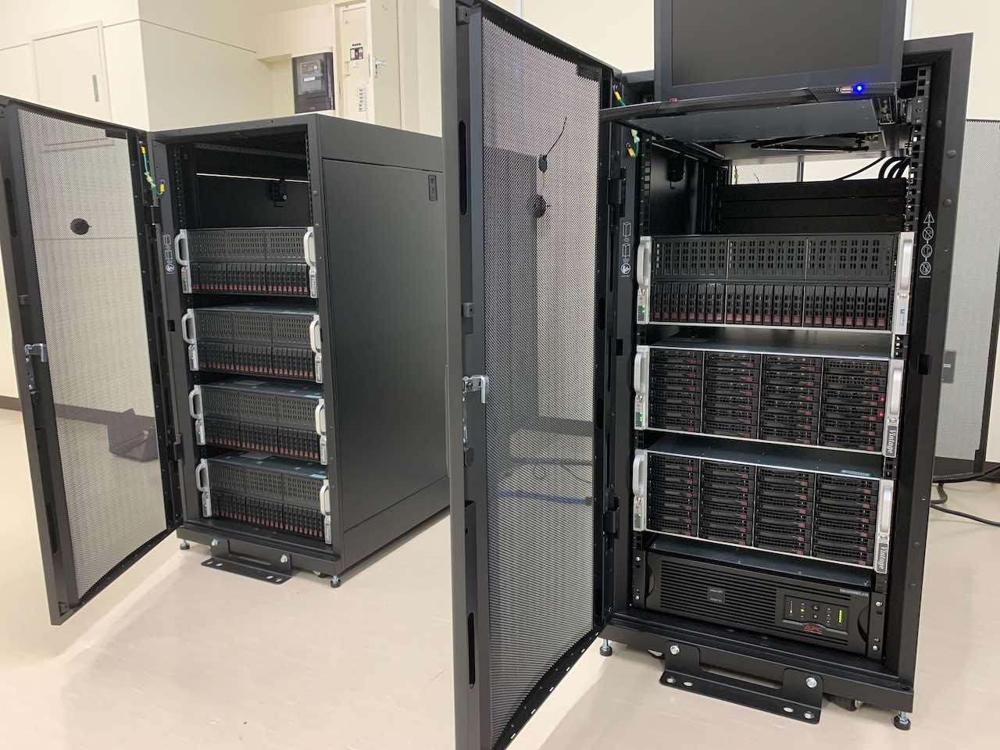

### Computers

* Large storage with RAID

* Large memory nodes for data analysis

* Compute nodes with GPUs

### Software

#### [MDToolbox.jl](https://github.com/matsunagalab/MDToolbox.jl) and [MDToolbox](https://github.com/ymatsunaga/mdtoolbox)

分子シミュレーションデータを統計解析するためのJulia/MATLABツールボックス。データのIO、原子選択、分子の重ね合わせ、多変量解析やクラスタリング、自由エネルギー推定、マルコフ状態モデリング等ができる。

#### [GENESIS](https://www.r-ccs.riken.jp/labs/cbrt/)

理化学研究所で開発しているタンパク質や核酸といった生体分子の分子動力学シミュレーションを行うソフトウェア。高度に並列化されていてスパコンやGPUで計算速度を向上することができる

