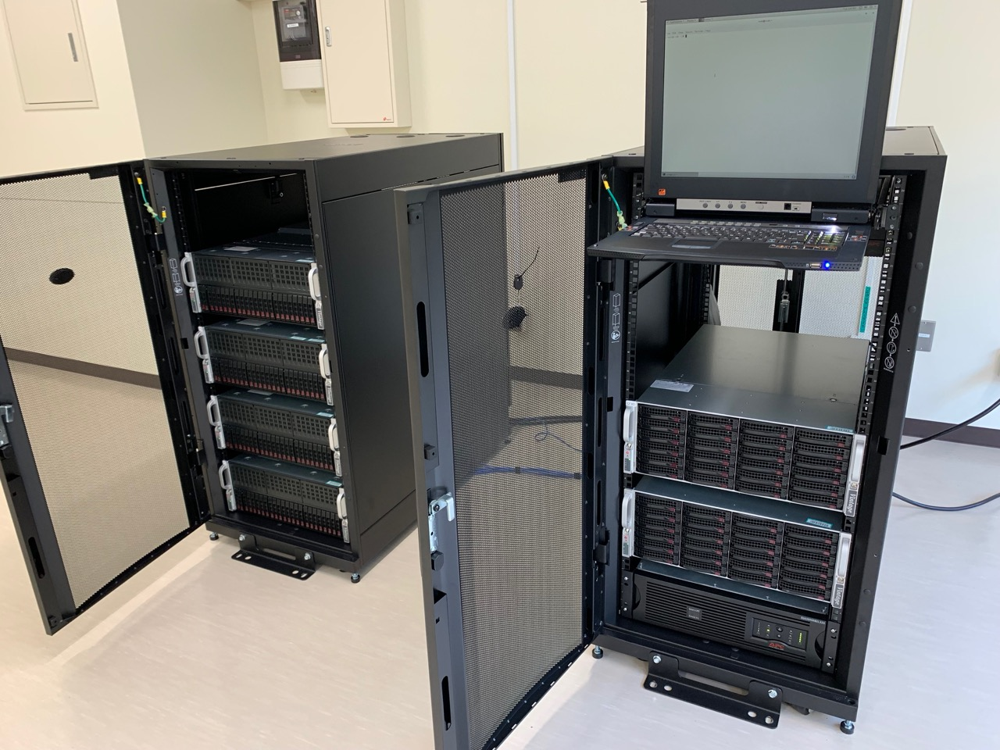

### Computers

* 200TB storage (RAID)

* 512GB memory node for large data analysis

* 5 computation nodes with the follwing GPUs

* 2x NVIDIA Quadro RTX8000

* 10x NVIDIA GTX 2080Ti

* 20x NVIDIA GTX 1080Ti

* 20x NVIDIA Titan-P

### Software

#### [MDToolbox.jl](https://github.com/matsunagalab/MDToolbox.jl) and [MDToolbox](https://github.com/ymatsunaga/mdtoolbox)

分子シミュレーションデータを統計解析するためのMATLB/Juliaツールボックス。データのIO、原子選択、分子の重ね合わせ、多変量解析やクラスタリング、自由エネルギー推定、マルコフ状態モデリング等ができる。

#### [GENESIS](https://www.r-ccs.riken.jp/labs/cbrt/)

理化学研究所で開発しているタンパク質や核酸(DNA・RNA)といった生体分子の分子動力学シミュレーションを行うソフトウェア。高度に並列化されていてスパコンやGPUで計算速度を向上することができる

